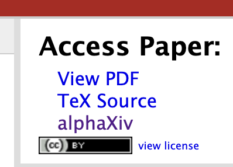

# arxiv-to-alphaxiv

A tiny userscript that adds an **alphaXiv** link to the *Access Paper* sidebar on arXiv abstract pages, letting you jump to the interactive [alphaXiv](https://www.alphaxiv.org/) view in one click.

## Install

1. Install a userscript manager:
   - [Tampermonkey](https://www.tampermonkey.net/) (Chrome, Edge, Safari, Firefox)
   - [Violentmonkey](https://violentmonkey.github.io/) (Chrome, Firefox)
2. [**Click here to install**](https://github.com/shaneisley/arxiv-to-alphaxiv/raw/main/arxiv-to-alphaxiv.user.js) — your userscript manager will prompt you to confirm.

Or open [`arxiv-to-alphaxiv.user.js`](./arxiv-to-alphaxiv.user.js), copy the contents into a new script in your manager.

## Usage

Visit any arXiv abstract page, e.g. <https://arxiv.org/abs/2211.17192>. An **alphaXiv** entry will appear in the *Access Paper* sidebar alongside *View PDF* and *TeX Source*. Clicking it opens <https://www.alphaxiv.org/abs/2211.17192> in a new tab.

The paper id (including any version suffix like `v2`) is preserved.

## How it works

The script appends a new `<li>` to arXiv's `.full-text ul` so the link inherits the page's native styling. If that selector ever changes, it falls back to a floating button in the bottom-right corner.

## License

MIT
